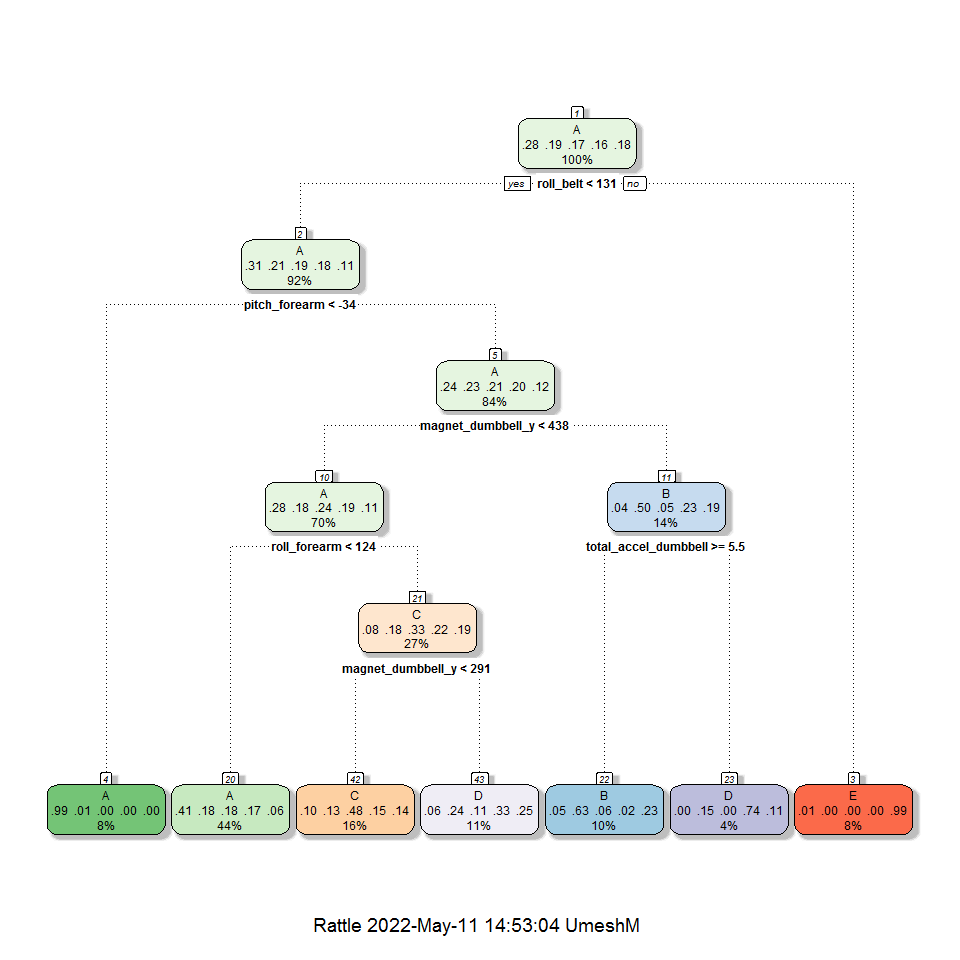
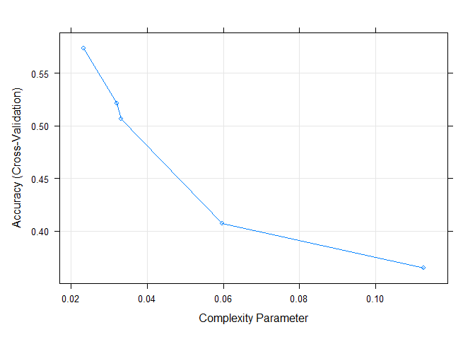
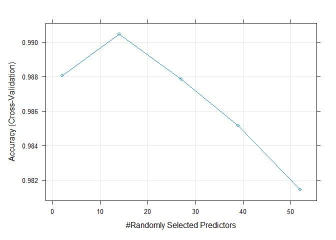
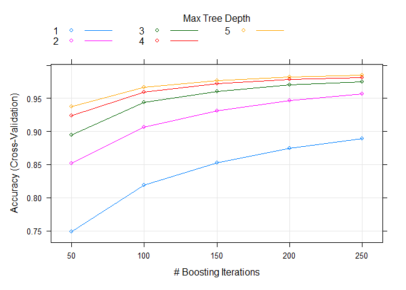
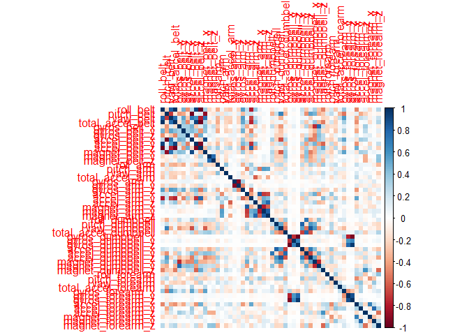

## Overview

This is the Final Project Report for Coursera’s Practical Machine Learning course, as part of the Data Science Specialization track offered by John Hopkins University.

In this project, we will use data from accelerometers on the belt, forearm, arm, and dumbell of 6 participants to predict the manner in which they did the exercise. This is the “classe” variable in the training set. We train 4 models: Decision Tree, Random Forest, Gradient Boosted Trees, Support Vector Machine using k-folds cross validation on the training set. We then predict using a validation set randomly selected from the training csv data to obtain the accuracy and out of sample error rate. Based on those numbers, we decide on the best model, and use it to predict 20 cases using the test csv set.


## Background

Using devices such as Jawbone Up, Nike FuelBand, and Fitbit it is now possible to collect a large amount of data about personal activity relatively inexpensively. These type of devices are part of the quantified self movement - a group of enthusiasts who take measurements about themselves regularly to improve their health, to find patterns in their behavior, or because they are tech geeks. One thing that people regularly do is quantify how much of a particular activity they do, but they rarely quantify how well they do it. In this project, your goal will be to use data from accelerometers on the belt, forearm, arm, and dumbell of 6 participants. They were asked to perform barbell lifts correctly and incorrectly in 5 different ways. More information is available from the website here: (http://groupware.les.inf.puc-rio.br/har) (see the section on the Weight Lifting Exercise Dataset).

The training data for this project are available here:

https://d396qusza40orc.cloudfront.net/predmachlearn/pml-training.csv

The test data are available here:

https://d396qusza40orc.cloudfront.net/predmachlearn/pml-testing.csv

The data for this project come from this source: http://web.archive.org/web/20161224072740/http:/groupware.les.inf.puc-rio.br/har.

## Loading Libraries and Data


```r
library(lattice)
library(ggplot2)
library(caret)
library(reshape2)
library(kernlab)
library(rattle)
library(corrplot)
set.seed(4587)

traincsv <- read.csv("./data/pml-training.csv")
testcsv <- read.csv("./data/pml-testing.csv")

dim(traincsv)
```

The training set contains 160 variables and 19622 observations whereas test set contains same number of variables and 20 observations.

## Data Cleaning

Removing unnecessary variables. Starting with N/A variables.


```r
traincsv <- traincsv[,colMeans(is.na(traincsv)) < .9] #removing mostly na columns
traincsv <- traincsv[,-c(1:7)] #removing metadata which is irrelevant to the outcome
```

Removing near zero variance variables.


```r
nvz <- nearZeroVar(traincsv)
traincsv <- traincsv[,-nvz]
dim(traincsv)
```

```
## [1] 19622    53
```

Now that we have finished removing the unnecessary variables, we will now split the training set into a validation and sub training set. The testing set “testcsv” will be left alone, and used for the final quiz test cases.


```r
inTrain <- createDataPartition(y=traincsv$classe, p=0.7, list=F)
train <- traincsv[inTrain,]
valid <- traincsv[-inTrain,]
```


## Creating and Testing Models

Four methods will be applied to model the regressions (in the Train dataset) and the best one (with higher accuracy when applied to the Test dataset) will be used for the quiz predictions. The methods are: Random Forests, Decision Tree, Generalized Boosted Model and Support Vector Machine, as described below.
A Confusion Matrix is plotted at the end of each analysis to better visualize the accuracy of the models.

Set up control for training to use 3-fold cross validation.


```r
control <- trainControl(method="cv", number=3, verboseIter=F)
```

### Random Forest


```r
rf_model <- train(classe~., data=train, method="rf", trControl = control, tuneLength = 5)
rf_pred <- predict(rf_model, valid)
```

Using confusion Matrix to test results:


```r
rf_cm <- confusionMatrix(rf_pred, factor(valid$classe))
rf_cm
```

```
## Confusion Matrix and Statistics
## 
##           Reference
## Prediction    A    B    C    D    E
##          A 1674   12    0    0    0
##          B    0 1123    7    0    0
##          C    0    4 1017    4    3
##          D    0    0    2  960    1
##          E    0    0    0    0 1078
## 
## Overall Statistics
##                                           
##                Accuracy : 0.9944          
##                  95% CI : (0.9921, 0.9961)
##     No Information Rate : 0.2845          
##     P-Value [Acc > NIR] : < 2.2e-16       
##                                           
##                   Kappa : 0.9929          
##                                           
##  Mcnemar's Test P-Value : NA              
## 
## Statistics by Class:
## 
##                      Class: A Class: B Class: C Class: D Class: E
## Sensitivity            1.0000   0.9860   0.9912   0.9959   0.9963
## Specificity            0.9972   0.9985   0.9977   0.9994   1.0000
## Pos Pred Value         0.9929   0.9938   0.9893   0.9969   1.0000
## Neg Pred Value         1.0000   0.9966   0.9981   0.9992   0.9992
## Prevalence             0.2845   0.1935   0.1743   0.1638   0.1839
## Detection Rate         0.2845   0.1908   0.1728   0.1631   0.1832
## Detection Prevalence   0.2865   0.1920   0.1747   0.1636   0.1832
## Balanced Accuracy      0.9986   0.9922   0.9945   0.9976   0.9982
```

### Decision Tree

#### Model


```r
trees_model <- train(classe~., data=train, method="rpart", trControl = control, tuneLength = 5)
fancyRpartPlot(trees_model$finalModel)
```

<!-- -->

#### Prediction


```r
trees_pred <- predict(trees_model, valid)
```

Using confusion Matrix to test results:


```r
trees_cm <- confusionMatrix(trees_pred, factor(valid$classe))
trees_cm
```

```
## Confusion Matrix and Statistics
## 
##           Reference
## Prediction    A    B    C    D    E
##          A 1540  492  475  433  158
##          B   19  339   23    9  115
##          C   76  122  451  131  130
##          D   37  186   77  391  167
##          E    2    0    0    0  512
## 
## Overall Statistics
##                                           
##                Accuracy : 0.5494          
##                  95% CI : (0.5365, 0.5621)
##     No Information Rate : 0.2845          
##     P-Value [Acc > NIR] : < 2.2e-16       
##                                           
##                   Kappa : 0.4123          
##                                           
##  Mcnemar's Test P-Value : < 2.2e-16       
## 
## Statistics by Class:
## 
##                      Class: A Class: B Class: C Class: D Class: E
## Sensitivity            0.9200  0.29763  0.43957  0.40560  0.47320
## Specificity            0.6300  0.96502  0.90554  0.90510  0.99958
## Pos Pred Value         0.4971  0.67129  0.49560  0.45571  0.99611
## Neg Pred Value         0.9519  0.85130  0.88442  0.88602  0.89387
## Prevalence             0.2845  0.19354  0.17434  0.16381  0.18386
## Detection Rate         0.2617  0.05760  0.07664  0.06644  0.08700
## Detection Prevalence   0.5264  0.08581  0.15463  0.14579  0.08734
## Balanced Accuracy      0.7750  0.63133  0.67255  0.65535  0.73639
```


### Gradient Boost Trees


```r
gbm_model <- train(classe~., data=train, method="gbm", trControl = control, tuneLength = 5, verbose = F)
gbm_pred <- predict(gbm_model, valid)
gbm_cm <- confusionMatrix(gbm_pred, factor(valid$classe))
gbm_cm
```

```
## Confusion Matrix and Statistics
## 
##           Reference
## Prediction    A    B    C    D    E
##          A 1672   10    0    0    2
##          B    2 1116    9    0    3
##          C    0   13 1014   12    4
##          D    0    0    3  950    3
##          E    0    0    0    2 1070
## 
## Overall Statistics
##                                           
##                Accuracy : 0.9893          
##                  95% CI : (0.9863, 0.9918)
##     No Information Rate : 0.2845          
##     P-Value [Acc > NIR] : < 2.2e-16       
##                                           
##                   Kappa : 0.9865          
##                                           
##  Mcnemar's Test P-Value : NA              
## 
## Statistics by Class:
## 
##                      Class: A Class: B Class: C Class: D Class: E
## Sensitivity            0.9988   0.9798   0.9883   0.9855   0.9889
## Specificity            0.9972   0.9971   0.9940   0.9988   0.9996
## Pos Pred Value         0.9929   0.9876   0.9722   0.9937   0.9981
## Neg Pred Value         0.9995   0.9952   0.9975   0.9972   0.9975
## Prevalence             0.2845   0.1935   0.1743   0.1638   0.1839
## Detection Rate         0.2841   0.1896   0.1723   0.1614   0.1818
## Detection Prevalence   0.2862   0.1920   0.1772   0.1624   0.1822
## Balanced Accuracy      0.9980   0.9884   0.9912   0.9921   0.9942
```

### Support Vector Machine


```r
svm_model <- train(classe~., data=train, method="svmLinear", trControl = control, tuneLength = 5, verbose = F)
svm_pred <- predict(svm_model, valid)
svm_cm <- confusionMatrix(svm_pred, factor(valid$classe))
svm_cm
```

```
## Confusion Matrix and Statistics
## 
##           Reference
## Prediction    A    B    C    D    E
##          A 1547  148   85   63   47
##          B   33  806   92   39  145
##          C   52   78  786   90   68
##          D   37   20   34  714   62
##          E    5   87   29   58  760
## 
## Overall Statistics
##                                           
##                Accuracy : 0.7839          
##                  95% CI : (0.7731, 0.7943)
##     No Information Rate : 0.2845          
##     P-Value [Acc > NIR] : < 2.2e-16       
##                                           
##                   Kappa : 0.7253          
##                                           
##  Mcnemar's Test P-Value : < 2.2e-16       
## 
## Statistics by Class:
## 
##                      Class: A Class: B Class: C Class: D Class: E
## Sensitivity            0.9241   0.7076   0.7661   0.7407   0.7024
## Specificity            0.9185   0.9349   0.9407   0.9689   0.9627
## Pos Pred Value         0.8185   0.7229   0.7318   0.8235   0.8094
## Neg Pred Value         0.9682   0.9302   0.9501   0.9502   0.9349
## Prevalence             0.2845   0.1935   0.1743   0.1638   0.1839
## Detection Rate         0.2629   0.1370   0.1336   0.1213   0.1291
## Detection Prevalence   0.3212   0.1895   0.1825   0.1473   0.1596
## Balanced Accuracy      0.9213   0.8213   0.8534   0.8548   0.8326
```

## Results


```r
models <- c("Decision Tree", "Random Forest", "Gradient Boost", "Support Vector Machine")
accuracy <- round(c( trees_cm$overall[1], rf_cm$overall[1], gbm_cm$overall[1], svm_cm$overall[1]),3) #accuracy
oos_error <- 1 - accuracy #out of sample error
data.frame(accuracy = accuracy, oos_error = oos_error, row.names = models)
```

```
##                        accuracy oos_error
## Decision Tree             0.549     0.451
## Random Forest             0.994     0.006
## Gradient Boost            0.989     0.011
## Support Vector Machine    0.784     0.216
```

From the above observation, we can conclude that the best model is the Random Forest model, with 0.994 accuracy and 0.006 out of sample error rate. We find that to be a sufficient enough model to use for our test sets. 

## Predictions on Test Set

Running our test set to predict the classe (5 levels) outcome for 20 cases with the Random Forest model.


```r
pred <- predict(rf_model, testcsv)
print(pred)
```

```
##  [1] B A B A A E D B A A B C B A E E A B B B
## Levels: A B C D E
```


## Appendix

The Github Repository containing files associated with this project report can be found at [Github](https://github.com/moolchandani/practical-machine-learning-project)

Plotting the **Decision Tree**, **Random Forest** and **Gradient Boosted Trees** models

```r
plot(trees_model)
```

<!-- -->

```r
plot(rf_model)
```

<!-- -->

```r
plot(gbm_model)
```

<!-- -->

correlation matrix of variables in training set

```r
corrPlot <- cor(train[, -length(names(train))])
corrplot(corrPlot, method="color")
```

<!-- -->


